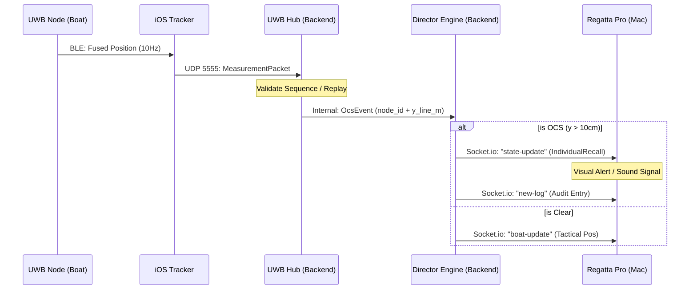

# System Integration Specification: Regatta Suite

This document outlines the architectural connection between **Regatta Pro (Mac)** and **Regatta Tracker (iOS)**, focusing on high-performance networking, shared states, and resilient fallback mechanisms.

## 🏗️ Architecture Overview

The system operates as a distributed real-time network where the **Backend (Rust)** acts as the source of truth, synchronizing state across field trackers (iOS) and race management dashboards (Mac/Web).

```mermaid
graph TD
    subgraph "Field Layer (iOS - Regatta Tracker)"
        T1[Tracker App 1]
        T2[Tracker App 2]
        U1((UWB Node 1))
        U2((UWB Node 2))
    end

    subgraph "Infrastructure (Nokia Private 5G + Backbone)"
        G1[Nokia AirScale gNB]
        E[Nokia MX Industrial Edge / DAC]
        B[RegattaPro Primary (Local Compute)]
        S[(state.json)]
        LK[LiveKit SFU (Local)]
        UH[UWB Hub UDP]
    end

    subgraph "Cloud Layer (AWS Unified Ecosystem)"
        CB[RegattaPro CloudVM (AWS Fargate)]
        DB[(Amazon Aurora PostgreSQL Serverless)]
        CS[Amazon S3 / Kinesis WebRTC Storage]
        RC[(Amazon ElastiCache Redis Pub/Sub)]
    end

    subgraph "Management Layer (Command & Control)"
        P[Regatta Pro Mac (Secondary Console)]
    end

    subgraph "External"
        BF[Broadcast Feed / Web]
    end

    %% Positioning & Telemetry
    U1 -.->|BLE: Optional Rugged| T1
    U2 -.->|BLE: Optional Rugged| T2
    
    %% Local Path (SNPN)
    T1 <-->|Private 5G (Data & Video)| G1
    T2 <-->|Private 5G (Data & Video)| G1
    G1 <-->|Local UPF| E
    
    %% Core Computing Triangle
    E <-->|Local Bus| B
    E -.-> S
    B <--> S
    
    %% Media Routing
    E ==>|WebRTC Routing| LK
    
    %% Cloud Sync & Failover (Shore Uplink)
    B <==>|Starlink: Realtime Sync & Media| CB
    CB <-->|Persistence| DB
    CB <-->|Pub/Sub| RC
    T1 -.->|Cellular Fallback| CB
    T2 -.->|Cellular Fallback| CB
    
    %% Archival
    LK -.->|Archival Sync via Starlink| CS
    
    %% Management Path
    P <-->|Control via Local Net| B
    P <-->|Failover Control| CB
    
    %% Broadcaster Feed
    CB ==>|Processed Feed & Video| BF
```

## ⚙️ Operational Topologies

The system operates in two primary topologies, where the "Source of Truth" (Primary Backend) shifts depending on the connectivity available.

### 1. Cloud-Primary Mode (Standard / Off-Shore)
*Used when racing near shore with reliable public 5G/LTE.*
- **Primary Compute**: Runs on a **RegattaPro CloudVM (AWS Fargate)**.
- **Secondary (Control) Mac**: The PRO uses a standard Mac as a management console. It mirrors the cloud state and sends commands to the CloudVM.
- **Data Flow**: Trackers -> Public 5G -> AWS CloudVM -> Control Mac.

### 2. SNPN-Primary Mode (Rugged / Local Edge)
*Used for high-stakes racing (UWB, High-bitrate video) with a Nokia 5G Private Network.*
- **Primary Compute**: The main RegattaPro instance runs directly inside the **Nokia SNPN System** (Local Edge node) on the management boat, handling all telemetry and video processing.
- **Secondary (Control) Mac**: The PRO uses a standard Mac to command the Local Edge Primary directly via the high-speed 5G hub.
- **RegattaPro CloudVM (AWS failover instance)**: A failover instance runs in AWS Fargate, receiving a real-time stream from the Edge via **Starlink**.
    - **Cloud Role (Active)**: Handles video routing to broadcast platforms and storage in S3.
    - **Cloud Role (Standby)**: If the SNPN bubble fails, Trackers flip to Public 5G and the AWS CloudVM takes over as the Primary (falling back to Option 1).

| Layer | Standard Option | High-Performance Option | Compatibility |
| :--- | :--- | :--- | :--- |
| **Positioning** | **iOS-Native (GPS)**: ~1-3m accuracy. | **Rugged (UWB)**: Sub-3cm accuracy via pairing. | Both work over any 5G connection. |
| **Connectivity** | **Public 5G / Cellular**: Standard latency/speed. | **Nokia Private 5G (SNPN)**: Ultra-low latency, high capacity. | Boosts UWB stability and Video FPS. |

---

## 📡 Networking & Connectivity

The system utilizes a hybrid network architecture, prioritizing a **Nokia Private 5G (SNPN)** for the race course "bubble," with local cellular (public) as a secondary fallback.

### 1. Nokia Private 5G (Primary Race Network)
- **RAN (Radio Access Network)**: 
    - **Nokia AirScale gNBs** (or compact Shikra/Banshee cells) are deployed on the management boat and 1–3 support boats/smart buoys for full course coverage.
    - **Bands**: Mid-band (n78 / 3.5 GHz) for optimal speed/range over water.
- **5G Core & Edge (Management Boat)**: 
    - **Nokia Digital Automation Cloud (DAC)** / **MX Industrial Edge** platform runs locally on the boat.
    - **Local UPF**: The backend engine and Mac Pro devices ingest UWB positions and video streams entirely within the local 5G bubble (zero internet reliance for core functions).
- **Device Support**: Recent iPhones/iPads use **eSIM (Private 5G SNPN)** profiles with specific PLMN IDs and slice parameters, ensuring trackers are locked to the private high-capacity network.

### 2. Shore Link & Uplink
- **Starlink Integration**: Processed tracking data, tactical overlays, and selected broadcast streams are pushed to shore via a high-capacity **Starlink** uplink from the management boat.
- **Data Reduction**: Only the final "processed" telemetry and broadcast feeds leave the boat; raw multi-angle video and 10Hz UWB data stay local to minimize latency and satellite costs.

### 3. Backbone (Rust Infrastructure)
- **Core Engine**: Built in Rust using `socketioxide` for real-time WebSocket communication and `actix-web`/`axum` for RESTful management.
- **State Synchronization**: Uses a shared `RwLock<RaceState>`. Real-time sync across containers is backed by **AWS ElastiCache (Redis)** Pub/Sub. On connection, clients receive an `init-state` event, followed by granular `state-update` and `boat-update` events.
- **Authentication**: Dual-layer auth using AWS Cognito JWTs (or custom signed tokens) with a fallback to legacy mock tokens for legacy hardware/testing environments.

---

## 💾 Memory & Persistence

### 1. Volatile (In-Memory) State
- **Telemetry History**: To ensure maximum performance, the `boats` map and `fleet_history` are kept strictly in-memory. They are **not persisted** to disk to prevent disk I/O bottlenecks during high-frequency racing.
- **Active Logs**: Recent logs (last 100 entries) are held in memory for immediate broadcast.

### 2. Persistent State (`state.json`)
- **Race Metadata**: Course layout (marks, lines, boundaries), wind settings, and race procedures (Procedure Architect nodes) are persisted.
- **Recovery**: On local backend restart, the `state.json` is reloaded to restore course boundaries and procedure nodes, preventing total race loss.

---

## 🎥 Streaming (Amazon Kinesis WebRTC Integration)

The `LiveStreamManager` handles AV synchronization:
- **Source**: iOS Tracker uses **Amazon Kinesis Video Streams with WebRTC** to publish camera and microphone tracks directly to the AWS Media layer.
- **Discovery**: Tracker apps pull signaling URLs and TURN/STUN tokens securely from the Rust Backend.
- **Direct Control**: The PRO (from the Mac app) can trigger a remote "Start Stream" on any specific boat to view live jury footage.

---

## 🛰️ UWB High-Precision Module (OCS Mode)

For elite racing and match racing where sub-3cm accuracy is required, the system supports an external UWB (Ultra-Wideband) hardware module connected to the iOS Tracker.

### 1. Data Path
- **Node-to-App (Thunderbolt)**: The UWB Node (e.g., Decawave-based) transmits fused local-frame positions to the iOS app via a **Thunderbolt cable**, ensuring zero-latency and high-bandwidth telemetry exchange.
- **App-to-Hub (UDP)**: The iOS app encapsulates these measurements into `MeasurementPackets` and sends them via **UDP (Port 5555)** to the Backend's `UwbHub`. Some configurations may use a **WiFi Relay** (ESP32-S3/nRF7002) for direct node-to-hub multicast.
- **Backend Processing**: The `UwbHub` validates sequence numbers (replay protection) and extracts the `y_line_m` (perpendicular distance to start line).

### 2. Operational Modes
- **Real-Time Mode**: Continuous 10Hz sub-3cm positioning for tactical overlay.
- **Batch Mode (At the Gun)**: Triggered concurrently during the final seconds of the countdown and continues slightly after the gun. The backend performs a high-density "Batch Solve" that merges the time axis (knowing historical and future trajectories), yielding incredibly accurate sub-cm OCS calls at exactly T-0.
- **PDoA / Angle-of-Arrival**: Advanced nodes support **Phase Difference of Arrival** (`pdoa.rs`) using dual-antenna setups to determine the precise angle to committee boats or buoy anchors, aiding in start-line calibration.
- **OCS Determination**: If `y_line_m > ocs_threshold_m` (default 10cm) and fix quality is high, the backend automatically flags the boat as **Individual Recall** and logs the event to the audit chain.

### 3. Data Flow Graph (UWB/OCS)


### 4. Hardware & Firmware Specifications
- **UWB Chipset**: Qorvo DW3720 / DW3110 for high-precision ranging.
- **Processing**: STM32U5 or nRF5340 MCU running a **no_std Rust** or C firmware.
- **Inertial Sensing**: BMI088 or ICM-42688 @ 400Hz integrated into a **6-DoF EKF** for stable position/orientation.
- **Timing**: Distributed clock synchronization via beacons and TDMA superframe (50ms slots).
- **Enclosure**: IP67 marine-grade housing with LiPo 2000mAh battery (~8h runtime).

---

## ☁️ Cloud Resiliency & Media Portal

The system bridges local high-performance hardware with a robust **AWS Unified Cloud Ecosystem** (Fargate, Aurora, S3, Kinesis) to ensure zero-downtime racing and global accessibility.

### 1. Failover & Redundancy
- **Management Hardware Failover**: If the Secondary Control Mac fails in SNPN mode, the **Local Edge Primary** continues collecting data. A new Mac can be introduced to the network, and the PRO can resume control without loss of data.
- **Cloud-Edge Handover**: A continuous `heartbeat` in the Aurora Database monitors the local hub. If the SNPN bubble collapses, iOS Trackers automatically switch to **Public Cellular**. They connect to the **RegattaPro CloudVM (AWS Fargate)**, which assumes **Primary** status.
- **Patched Gaps**: The switch between SNPN and Cloud is smoothed by the **iOS Tracker's Internal Log**. Any data missed during the few seconds of network switching is flushed to the new Primary as soon as connection is established.

### 2. Media Portal & Storage
- **Routing & Archival**: In SNPN mode, the **RegattaPro CloudVM** acts as the primary router for live broadcast feeds via Kinesis WebRTC. It ingests the Edge-to-Starlink feed and distributes it to web platforms while simultaneously archiving to **Amazon S3 Storage**.
- **Jury Review**: Jurors can access high-bitrate footage from the Cloud Portal (S3), which remains operational even if the local race hardware is powered down or disconnected after racing.

### 3. Ubiquiti High-Bandwidth Backhaul (Video)
To optimize costs for high-bitrate 4K multi-stream uplinks, the system utilizes a **Ubiquiti GigaBeam LR (60GHz + 5GHz failover)** link when within range of the harbour or a dedicated relay station.
- **Failover Logic**: The `UwbHub` or `MediaRouter` prioritizes the Ubiquiti link for video traffic. If the 60GHz link drops below a performance threshold, it fails over to the **5GHz integrated radio**, and ultimately back to **Starlink** for critical telemetry only.
- **Strategic Routing**: Starlink is reserved for high-reliability race control state and OCS telemetry, while the Ubiquiti link handles the heavy media ingest to the AWS Cloud.

---

## 🛡️ Fallback & Resiliency Mechanisms

| Scenario | System Response |
| :--- | :--- |
| **Tracker Disconnection** | Backend retains boat entry for 30s as "Active" then marks as "Inactive". Historical pings (last 360) are kept to allow the boat to "re-appear" on the map without losing its track. |
| **Backbone Crash** | Backend reloads `state.json` on boot. Course and rules are restored immediately. Race management must manually "Restart Sequence" or "Resume" if a countdown was active. |
| **Cellular Drop (Tracker)** | `LiveStreamManager` attempts automatic reconnection to the SFU. Socket.io client handles exponential backoff for telemetry. |
| **Starlink Outage** | System falls back to cellular if available, or caches telemetry locally on the Edge for later sync. |
| **Ubiquiti 60GHz Drop** | Automatic failover to 5GHz radio; if both fail, video streams are throttled or paused to preserve Starlink bandwidth for race logic. |
| **Corrupt State File** | `persistence.rs` catches serialization errors and initializes a safe `RaceState::default()`. |


---

## 🔄 App Interplay

1.  **Regatta Pro** designs the course and "Deploys" it.
2.  **Rust Backend** serializes this to `state.json`.
3.  **Regatta Trackers** join the race ID, receive the `init-state` (with the course), and begin streaming telemetry.
4.  **Backend** executes the logic (OCS detection, layline calculations) and broadcasts updates.
5.  **Regatta Pro** visualizes the race, manages the "Start Procedure", and views streams.
